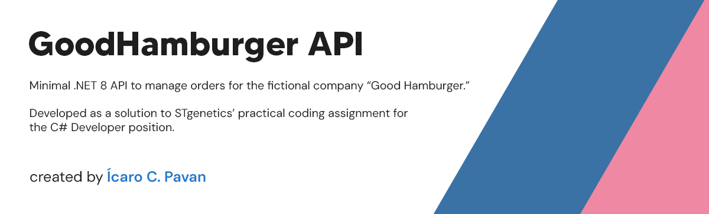

# Good Hamburger API

## Project Description

This project implements a RESTful API using .NET 8 Minimal APIs. It stores data in memory and follows the Repository + Service pattern to separate concerns. It includes:

* Endpoints to list menu items (sandwiches and extras);
* CRUD operations for orders;
* Business validations as specified in the test;
* Global exception handling;
* Automatic documentation via Swagger.

## Prerequisites

* .NET 8+ SDK
* Windows, Linux or macOS

## How to run

1. **Clone the repository**

    ```bash
    git clone https://github.com/icaropvn/stgen-test.git
    cd stgen-test
    ```

2. **Restore dependencies**

    ```bash
    dotnet restore GoodHamburger.sln
    ```

3. **Build in release mode**

    ```bash
    dotnet build GoodHamburger.sln -c Release
    ```

4. **Run the API**

    ```bash
    dotnet run --project GoodHamburger.Api/GoodHamburger.Api.csproj -c Release
    ```

   _The API will be exposed on a port indicated by the .NET output, for example `https://localhost:5001`._


5. **Access Swagger UI**

   Open in your browser:
   `https://localhost:{port}/swagger`
   to view the interactive documentation and test the endpoints.

## Endpoints

### Menu

* `GET /api/menu` — list all items
* `GET /api/menu/sandwiches` — list only sandwiches
* `GET /api/menu/extras` — list only fries and soft drinks (extras)

### Orders

* `GET /api/orders` — list all orders
* `GET /api/orders/{id}` — retrieve a specific order by ID
* `POST /api/orders` — create a new order
* `PUT /api/orders/{id}` — update an existing order
* `DELETE /api/orders/{id}` — delete an order

## Notes

* State is stored only in memory. Restarting the application will clear all orders.

## Contact

Ícaro Costa Pavan • [icaro.pavan97@gmail.com](mailto:icaro.pavan97@gmail.com) • [LinkedIn](https://www.linkedin.com/in/icaro-pavan/)
